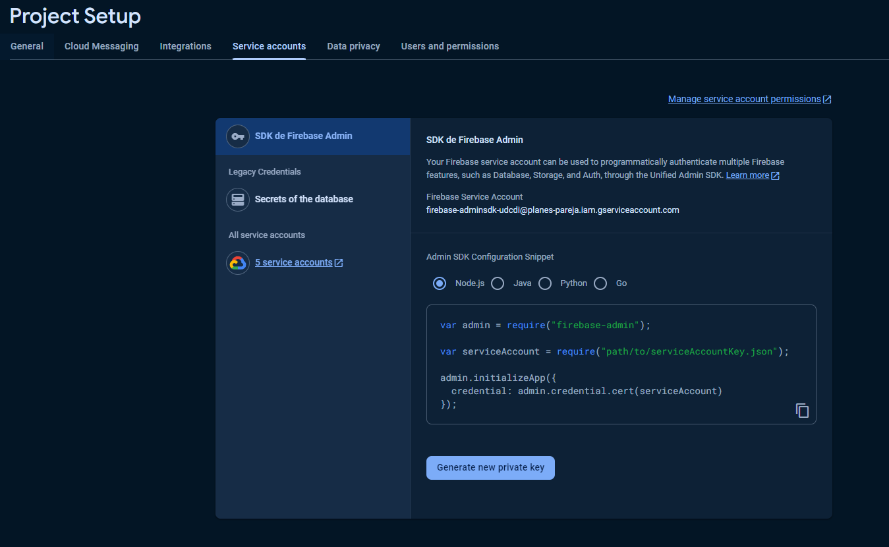
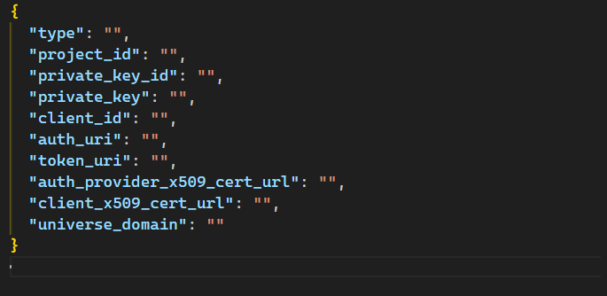

This project is simply used to upload all the necessary data quickly to your Cloud Firestore by adding it directly from a json file.

All you have to do is go to the configuration of your project where you have the database and download the json file that is generated with your private key.  
You can find this in the project configuration in the "Service accounts" tab as you can see in the following image.

You have to download a file with a structure like the "key_service_account.template.json" file.

Once this is done, you put the file in your project renaming it with the name "key_service_account.json".

Finally, rename the "data.template.jsonc" file to "data.json", fill it with the data you want to load and run the project with "npm start" to load the data.
